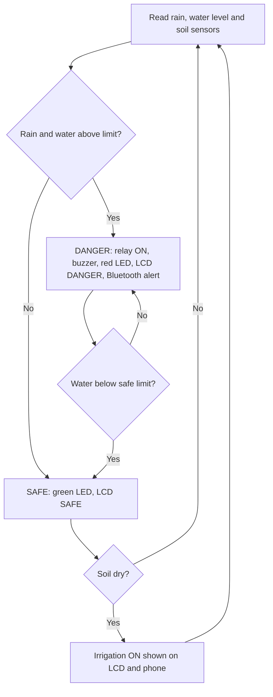

# Smart Rainwater Overflow & Pathway Protection System

An Arduino Uno prototype that detects rain and rising water on campus walkways, switches on a drain relay, warns people with a buzzer, LEDs and an LCD, sends Bluetooth alerts to a phone, and shows how drained rainwater can be reused for irrigation.

> **Status:** Working prototype. The drain pump is represented by a relay and the irrigation by a message on the LCD and phone. A full-size version would use a real pump, storage tank and drip irrigation.

## Table of contents

- [Problem statement](#problem-statement)
- [Solution](#solution)
- [Features](#features)
- [How it works](#how-it-works)
- [Hardware required](#hardware-required)
- [Pin connections](#pin-connections)
- [Software setup](#software-setup)
- [Build and test steps](#build-and-test-steps)
- [Calibration](#calibration)
- [Expected output](#expected-output)
- [Troubleshooting](#troubleshooting)
- [Limitations](#limitations)
- [Future scope](#future-scope)
- [Repository structure](#repository-structure)
- [License](#license)
- [Author](#author)

## Problem statement

When it rains, water collects in low spots on college campuses. Walkways become slippery and unsafe, and students risk slipping or have to avoid the path. There is no low-cost automatic system to detect the pooling, remove the water, warn people on the spot and alert maintenance staff. The collected rainwater is also wasted instead of being reused.

## Solution

A low-cost Arduino-based unit that senses, decides, acts and warns automatically:

1. A **rain sensor** confirms that it is raining.
2. An **ultrasonic sensor (HC-SR04)** measures the water level in the low spot.
3. The **Arduino Uno** turns the drain relay ON when both conditions are met, and OFF when the water is safe again.
4. A **red LED, buzzer and LCD** show DANGER; a **green LED and LCD** show SAFE.
5. A **Bluetooth module** sends alert messages to a phone.
6. A **soil moisture sensor** checks a garden bed and shows when irrigation with the collected water is needed.

## Features

- Automatic detection of rain and rising water
- Two-threshold (hysteresis) control, so the relay does not switch on and off repeatedly
- Local warning with red/green LEDs, buzzer and a 16x2 LCD (DANGER / SAFE)
- Bluetooth alerts to a phone serial terminal app
- Soil-moisture-based irrigation indication (rainwater reuse concept)
- Live sensor values on the Serial Monitor for debugging
- Low cost, built from common modules

## How it works



**Control logic**

- Water distance is measured from the sensor (mounted above the low spot) to the water surface.
- Danger starts when it is raining **and** the distance is less than `HIGH_CM`.
- Danger ends when the distance becomes greater than `LOW_CM` (a larger value than `HIGH_CM`). The gap between the two values prevents flickering.
- Irrigation is indicated only while the system is SAFE and the soil reading is above `DRY_VALUE`.

## Hardware required

| Component | Quantity | Purpose |
|---|---|---|
| Arduino Uno | 1 | Main controller |
| Rain sensor module (with control board) | 1 | Detects rain |
| HC-SR04 ultrasonic sensor | 1 | Measures water level |
| 5V relay module | 1 | Represents the drain pump switch |
| Soil moisture sensor | 1 | Checks garden bed dryness |
| Bluetooth module (HC-05 / HC-06) | 1 | Phone alerts |
| 16x2 LCD with I2C backpack | 1 | DANGER / SAFE display |
| Buzzer | 1 | Sound warning |
| Red LED and green LED | 1 each | DANGER / SAFE lights |
| 220 ohm resistors | 2 | LED current limiting |
| 1k and 2k ohm resistors | 1 each | Bluetooth RX voltage divider |
| Breadboard and jumper wires | as needed | Connections |
| 9V battery (or USB) | 1 | Power |
| Plastic box, cup, small pot with soil | 1 each | Model for demonstration |

## Pin connections

| Part | Arduino pin |
|---|---|
| Rain sensor DO | D2 |
| Bluetooth TX | D4 |
| Bluetooth RX | D5 (through 1k/2k divider) |
| Red LED (with 220 ohm) | D6 |
| Relay IN | D7 |
| Buzzer | D8 |
| HC-SR04 Trig | D9 |
| HC-SR04 Echo | D10 |
| Green LED (with 220 ohm) | D11 |
| Soil sensor AO | A0 |
| LCD SDA | A4 |
| LCD SCL | A5 |

- Connect all module VCC pins to **5V** and all GND pins to **GND** (common ground).
- **Bluetooth RX** accepts only 3.3V: connect a 1k resistor from D5 to the module RX, and a 2k resistor from that RX pin to GND.
- Keep the prototype **low-voltage only**. Never connect mains power to the relay in a demo.

## Software setup

1. Install the [Arduino IDE](https://www.arduino.cc/en/software).
2. Install the **LiquidCrystal I2C** library (by Frank de Brabander) from Sketch > Include Library > Manage Libraries.
3. Open `code/rainwater_overflow_lcd.ino`.
4. Select Tools > Board > Arduino Uno and the correct port, then upload.
5. Open the Serial Monitor at **9600 baud** to see live sensor values.

## Build and test steps

Test each part alone before joining everything together.

1. **Arduino:** Upload the Blink example to confirm the board and port work.
2. **Rain sensor:** Print `digitalRead(2)` and drop water on the plate (LOW means wet on most modules).
3. **HC-SR04:** Print the distance in cm and move your hand to check the values.
4. **Relay, buzzer, LEDs:** Turn each on for a second. If the relay works the wrong way round, swap `RELAY_ON` and `RELAY_OFF`.
5. **Bluetooth:** Pair with your phone (default PIN usually 1234 or 0000), open a Bluetooth serial terminal app and send text at 9600 baud.
6. **Soil sensor:** Print `analogRead(A0)` in dry and wet soil and note both values.
7. **LCD:** Upload a small test sketch that prints SAFE and DANGER.
8. **Full code:** Upload `rainwater_overflow_lcd.ino`.
9. **Model:** Mount the HC-SR04 on a stand above a plastic box facing down, place the rain sensor beside it, and put the soil sensor in a small pot.

## Calibration

Edit these constants in the code after testing your own setup:

| Constant | Meaning |
|---|---|
| `HIGH_CM` | Water closer than this (cm) triggers DANGER |
| `LOW_CM` | Water farther than this (cm) returns to SAFE |
| `DRY_VALUE` | Soil reading above this means dry |
| `WET_VALUE` | Soil reading below this means wet |
| `RELAY_ON` / `RELAY_OFF` | Swap if your relay is active-HIGH |
| LCD address `0x27` | Change to `0x3F` if the screen stays blank |

## Expected output

| Situation | System response |
|---|---|
| No rain, water low | Green LED ON, LCD shows `STATUS: SAFE` |
| Rain detected and water above limit | Relay ON, buzzer ON, red LED ON, LCD shows `STATUS: DANGER!`, phone gets `ALERT: Water rising, pump ON` |
| Water drops below safe limit | Relay OFF, buzzer OFF, green LED ON, LCD shows `STATUS: SAFE`, phone gets `Water level normal, pump OFF` |
| Soil dry while SAFE | LCD shows `Irrigation ON`, phone gets `Irrigation ON` |
| Soil wet again | Irrigation message stops |

## Troubleshooting

| Problem | Likely cause and fix |
|---|---|
| LCD is blank | Adjust the contrast screw on the back, try address `0x3F`, check SDA/SCL wiring |
| Relay always on or reversed | Relay is active-LOW; swap `RELAY_ON` and `RELAY_OFF`, and check D7 goes to IN |
| No Bluetooth text | TX/RX crossed or divider missing; module TX goes to D4, RX to D5 |
| Rain sensor never changes | Turn the blue potentiometer on its control board until its LED changes |
| Distance always 999 or 0 | Check Trig/Echo wires (D9, D10), 5V and GND |
| Random behaviour | Missing common GND between modules and the Uno |

## Limitations

- This is a single-node prototype; the relay represents the pump and no real tank or drip system is built.
- HC-SR04 readings can be affected by the sensor angle, ripples and the shape of the container.
- Thresholds must be calibrated for each installation.
- The rain sensor plate corrodes over time in real outdoor use.

## Future scope

- Multiple sensor nodes across the campus to find which walkways flood first
- Solar power with a battery
- Real pump, storage tank and drip irrigation
- Data logging of rain and water levels to spot recurring problem areas
- Wi-Fi/IoT dashboard using a Wi-Fi capable board

## Repository structure

```
.
├── README.md
├── code/
│   └── rainwater_overflow_lcd.ino
├── docs/
│   └── project_report.docx
└── images/
    ├── circuit_photo.jpg
    └── demo.gif
```

## License

This project is released under the MIT License. Add a `LICENSE` file to the repository.

## Author

**Shamini**, Electronics and Communication Engineering student
Add your college name, email and LinkedIn link here.
